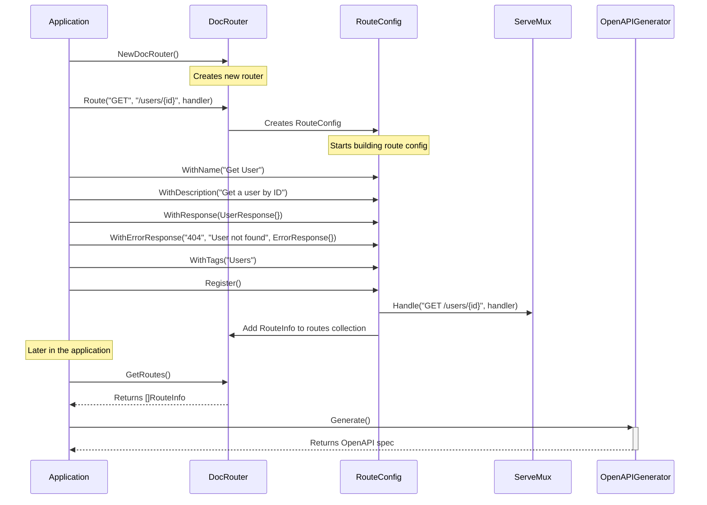
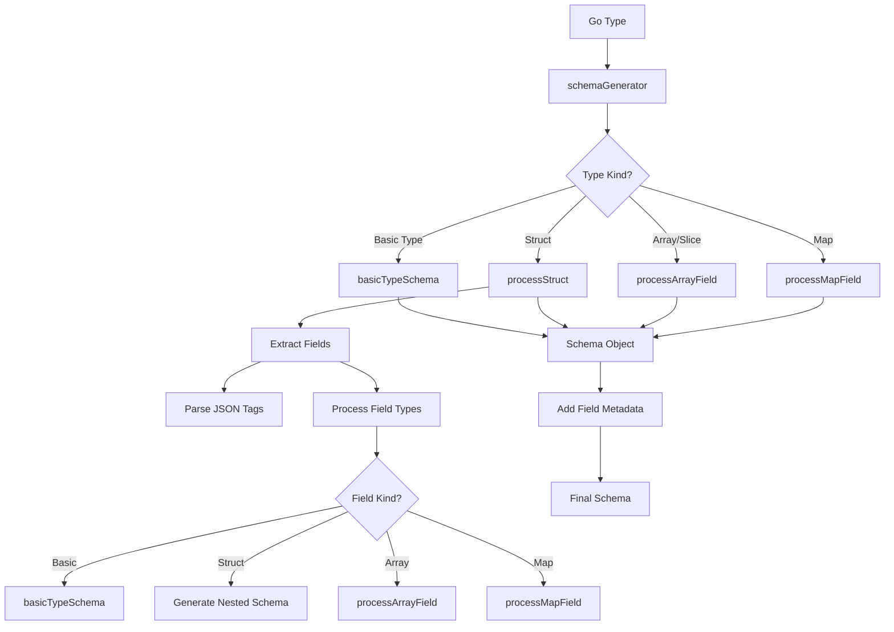
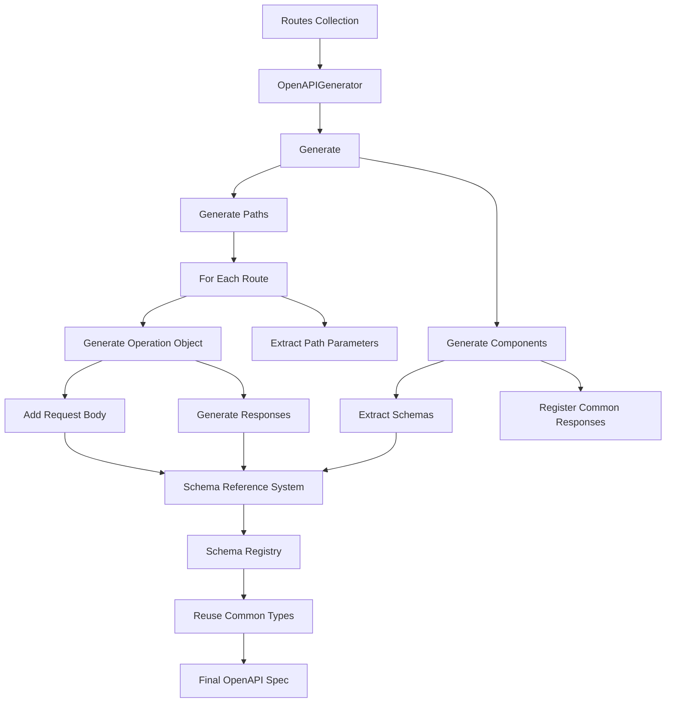

# openapi-router-go

> auto-openapi generation for Go HTTP services

- code-first documentation: define your api in go code and automatically generate documentation
- type safety: schema generation is based on actual go types
- fluent api: intuitive builder pattern for configuring routes
- standard library integration: built on top of go's standard `http.servemux`
- zero external dependencies: relies only on go's standard library

> note: go 1.22+ is a pre-requisite given the use of http.servemux

for instance:

```go
// create a new router
router := router.NewDocRouter()

// define a route with full documentation
router.Route("GET", "/users/{id}", getUserHandler).
    WithName("Get User").
    WithDescription("Retrieve a user by their unique identifier").
    WithResponse(UserResponse{}).
    WithErrorResponse("404", "User not found", ErrorResponse{}, 
        router.Example{
            ContentType: "application/json",
            Value: `{"error": "user not found"}`,
        },
    ).
    WithTags("Users").
    Register()


// generate openapi documentation
generator := router.NewOpenAPIGenerator(
    "User API",
    "API for managing users",
    "1.0.0",
    router.GetRoutes(),
)

data, _ := json.MarshalIndent(generator.Generate(), "", "  ")
_ := os.WriteFile("openapi.json", data, 0644)
```


## route definition workflow



## schema gen



note that here we include special handling for:

- circular references to prevent infinite recursion
- special types like `time.Time` and `json.RawMessage`
- field metadata from struct tags (`json`, `doc`, `example`, `enum`)
- required vs. optional fields (based on `json:"field,omitempty"` tags)

## openapi spec gen



## License

MIT (do whatever)
