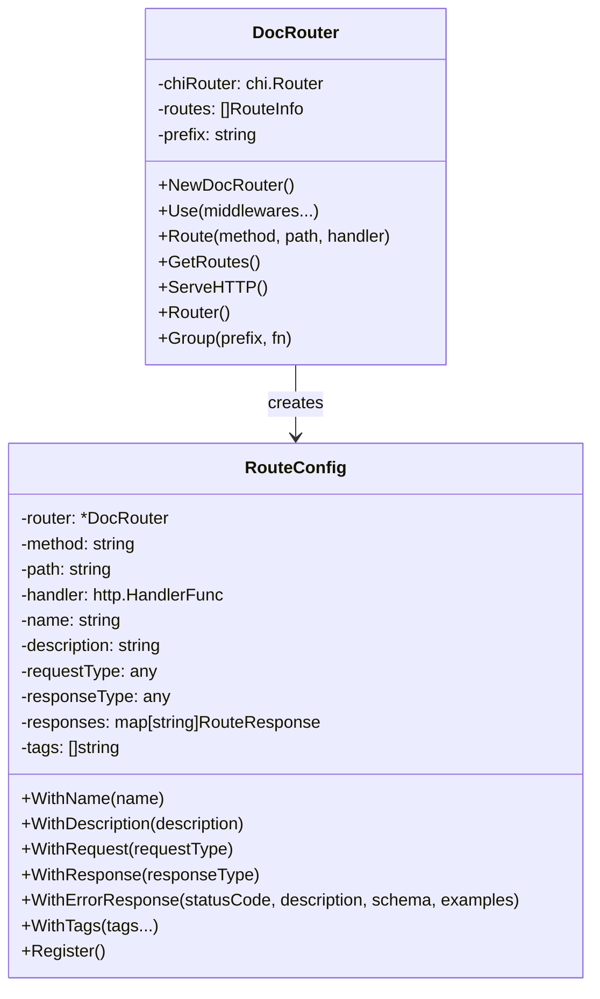
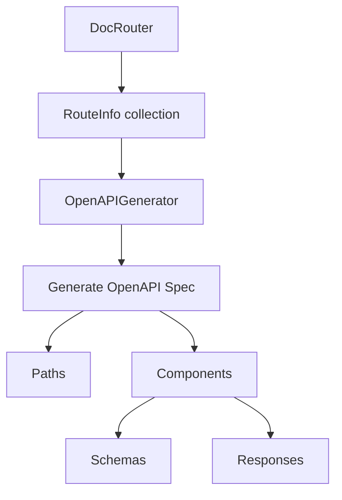
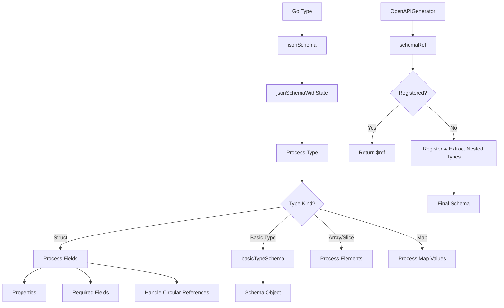

# Router Package Documentation

## Overview

The router package provides a Chi router wrapper that adds documentation capabilities, particularly focused on generating OpenAPI specifications. It allows API creators to define routes with detailed information about requests, responses, and schemas, which can then be automatically converted to OpenAPI documentation.

## Core Components

### 1. DocRouter

The `DocRouter` is the central component that wraps the Chi router to add documentation capabilities:



The `DocRouter` provides a fluent API for defining routes with detailed documentation:

```go
router := router.NewDocRouter()

router.Route("GET", "/users/{id}", getUser).
    WithName("Get User").
    WithDescription("Get a user by ID").
    WithResponse(UserResponse{}).
    WithErrorResponse("404", "User not found", ErrorResponse{}).
    WithTags("Users").
    Register()
```

### 2. OpenAPI Generation

The `OpenAPIGenerator` converts the documented routes into an OpenAPI specification:



The generator creates:
- Path definitions for each route
- Schema definitions for request and response types
- Standard response patterns
- Parameter definitions

### 3. Schema Generation (schema.go)

The `schema.go` file contains the core functionality for generating JSON Schema from Go types. This is a critical component that enables automatic documentation of API request and response types.



## Key Functionality in schema.go

### 1. Type Processing with Circular Reference Handling

The `schemaProcessingState` struct and related functions track types being processed to detect and handle circular references, which is essential for preventing infinite recursion during schema generation.

### 2. Schema Generation

The `jsonSchema` function is the entry point for converting Go types to JSON Schema:

- Handles basic types (string, int, bool, etc.)
- Processes struct fields with proper JSON tag handling
- Supports nested types, arrays, and maps
- Detects and handles circular references
- Extracts documentation from struct tags

### 3. Schema Registry

The schema registry enables reuse of type definitions:

- Tracks schema definitions by type name
- Enables $ref references in the generated OpenAPI spec
- Prevents duplicate definitions
- Extracts nested types for comprehensive documentation

### 4. Type Name Extraction

The `getTypeName` function extracts a Go type name from an interface value, which is crucial for generating proper schema references.

### 5. Field Processing

The `fieldToSchemaWithState` function handles conversion of struct fields to JSON schema:

- Special handling for time.Time and json.RawMessage
- Processing of various field tags (doc, example, enum)
- Support for nested structs, arrays, and maps
- Type-appropriate schema generation

### 6. Nested Type Extraction

The `extractNestedTypes` function finds nested type definitions within a schema and registers them separately, allowing for reuse and improved organization.

## Importance of the Functionality

### 1. Code-First API Documentation

The schema generation functionality enables a code-first approach to API documentation:

- Developers can define their API in Go code
- Documentation is automatically generated from the code
- Reduces the risk of documentation becoming out of sync with code

### 2. Type Safety

By generating schemas directly from Go types:

- Ensures the documentation accurately reflects the actual types used
- Provides clear expectations for API consumers
- Helps identify potential issues at compile time rather than runtime

### 3. Documentation as a First-Class Citizen

The router package makes documentation a first-class concern:

- Route definitions include documentation metadata
- Schemas are automatically generated from types
- OpenAPI specifications can be generated with a single function call

### 4. Support for Complex Type Relationships

The schema generation handles complex type relationships:

- Nested types are properly represented
- Circular references are handled gracefully
- Arrays and maps are correctly documented

## Areas for Simplification

While the current implementation is functional, there are several areas where the schema.go file could be simplified:

1. **Reduce complexity in the schema generation process**
2. **Remove duplicate functionality**
3. **Improve handling of special types**
4. **Streamline nested type extraction**
5. **Better organize the code for maintainability** 